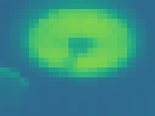

# Multi-Modal Sensor Array

## Overview

The Multi-Modal Sensor Array is a project developed as a contribution to the Dirigible being built by the Computer Science (CS) Department at Colorado Mesa University (CMU), funded by a NASA grant. This project aims to enhance the capabilities of the dirigible by creating a versatile sensor array and associated drivers for data collection during its expeditions through dense jungles. The sensor array comprises three sensors: a Mega-pixel wide-angle camera, an Infrared camera, and an Infrared spectrometer. In addition to the drivers for data collection and storage, the project includes tools for visualizing the collected data.

(Note that the dirigible image above is fake and was generated by Stable Diffusion at: https://stablediffusionweb.com)

## Objectives

The primary objectives of the Multi-Modal Sensor Array project are as follows:

1. Develop drivers for seamless integration and efficient operation of the sensor array with the Dirigible.
2. Enable data collection from the three sensors: Mega-pixel wide-angle camera, Infrared camera, and Infrared spectrometer.
3. Implement data storage mechanisms to ensure reliable and organized data management.
4. Facilitate fine-tuning of the sensor array through flexible configuration files.
5. Create visualization tools to analyze and interpret the collected data effectively.

## Features

### Sensor Drivers

The project provides a comprehensive set of drivers designed to interface with the sensor array components seamlessly. These drivers handle data collection from the Mega-pixel wide-angle camera, Infrared camera, and Infrared spectrometer. They ensure smooth communication between the sensors and the Dirigible's main system, allowing for synchronized data capture.

### Data Collection and Storage

The drivers are responsible for efficiently collecting data from the sensor array. The collected data is then stored in a well-structured manner, ensuring integrity and easy access. The project incorporates robust data storage mechanisms to handle the potentially large volume of data generated during the Dirigible's jungle expeditions.

### Configuration Files

To provide flexibility and adaptability, the project allows for fine-tuning of the sensor array through configuration files. These files offer adjustable parameters and settings that can be modified based on the specific requirements of each expedition. By modifying the configuration files, users can optimize the sensor array's behavior to cater to various environmental conditions and research goals.

### Data Visualization Tools

The Multi-Modal Sensor Array project includes powerful tools to visualize and analyze the collected data. One of the visualization tools is a calibrated approach for superimposing the infrared camera image onto the larger Mega-pixel image. This overlay enables a more comprehensive understanding of the captured scenes by combining both visual and infrared perspectives. We have selected examples below to demonstrate the overlay's effectiveness in highlighting the heat signatures of objects in the scene.

Additionally, the project provides a configurable radar graph capable of displaying spectrographic data. This graph helps researchers visualize and interpret the intricate details and patterns present in the gathered spectrographic information.

